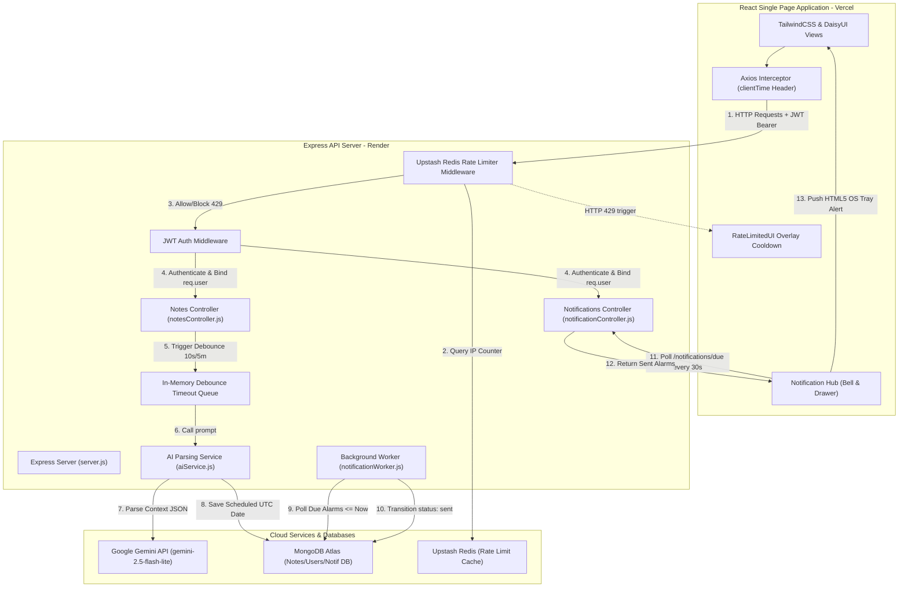

# Docket - Intelligent Note-Taking, Secure Workspaces & Agentic AI Scheduler

Docket is a secure, multi-user web application designed for personal knowledge management, task categorization, and real-time cognitive reminders. It combines a clean, Notion-like rich-text noting canvas with an agentic AI background processing engine that analyzes user entries for task schedules, goals, and emotional states, delivering desktop-native push notifications and interactive dialogue channels.

---

## Key Capabilities

### 1. Isolated Multi-User Workspaces
* **Session Boundaries**: Enforces strict JSON Web Token (JWT) authorization on all API requests.
* **Data Partitioning**: Isolates all database operations (notes, folders, categories, and notification channels) dynamically using MongoDB object ownership scopes. A user can only access or mutate their own records.

### 2. Context-Aware AI Persona Assistant
* **Dynamic Persona Assignment**: Evaluates note semantics to dispatch notifications from a targeted persona channel suited to the user's specific state (e.g. calming support for anxiety, tutoring for academic tasks, scheduling alerts for administrative tasks, or open chats for personal achievements).
* **Dual-Speed Debounce Queue**: Incorporates an in-memory queue to protect API usage and lower costs. Notes with time keywords trigger analysis within **10 seconds**, while emotional journaling entries without timing details delay analysis for **5 minutes**, letting users finish typing without interruptions.

### 3. Integrated Native Alerting & Dialogue
* **Native OS Alerts**: Integrates the standard browser HTML5 Notification API to deliver background desktop push notifications (Windows, macOS, Linux) even when the browser is minimized.
* **Interactive Timelines**: Sliding workspace drawer handles notification history, quick-reply buttons, custom reply fields, and typing indicators, triggering immediate LLM dialogue follow-ups when users respond.

---

## System Architecture

Docket's decoupled client-server architecture utilizes a combination of relational document stores, serverless key-value caches, and background workers:



---

## Security & Authentication Model

Docket implements a defense-in-depth security model to safeguard user data:
* **Token-Based Sessions**: Directs stateless user sessions using secure JWT Bearer authentication headers on the client.
* **Google OAuth 2.0**: Incorporates Google Identity Services on the client. The backend validates and decodes the JWT ID token natively, provisioning new workspaces or linking profiles securely.
* **IP-Partitioned Sliding Window Rate Limiting**: Features an Express rate limiter middleware connected to Upstash Redis database caches. Limits are isolated per client IP address (allowing 30 requests per 10 seconds), preventing global Denial of Service (DoS) conditions and brute-force login attempts.
* **Database Injection Prevention**: Uses Mongoose Object-Document Mapping (ODM) to enforce strict schema casting on query inputs, neutralizing NoSQL injection vectors.
* **Safe Error Masking**: Sanitizes API response payloads in catch-blocks. Full debug stack traces are printed to the server logs, while standard masked error messages (e.g., "Internal server error") are returned to the client to prevent database or engine leakage.

---

## Technical Directory Structure

The project is structured as a decoupled monorepo containing distinct client, server, and documentation directories:

```text
docket-root/
├── backend/                       # Express API Server (Node.js)
│   ├── src/
│   │   ├── config/                # Database and Redis rate limiter configs
│   │   ├── controllers/           # Auth, Note, Folder, and Notification handlers
│   │   ├── middleware/            # JWT and Rate Limiter interceptors
│   │   ├── models/                # User, Note, Folder, and Notification schemas
│   │   ├── routes/                # API router entry maps
│   │   ├── services/              # Gemini integrations and timezone parsers
│   │   ├── workers/               # Background task scheduler worker
│   │   └── server.js              # Server bootstrapper & global settings
│   └── README.md                  # Backend developer's guide
│
├── frontend/                      # React SPA Client (Vite)
│   ├── public/                    # Static assets & app icon
│   ├── src/
│   │   ├── components/            # Reusable UI cards and Notification Hub drawer
│   │   ├── lib/                   # Axios client instance with client-time headers
│   │   ├── pages/                 # Routing pages (Auth, Home, Create, Detail)
│   │   └── main.jsx               # React entry point
│   ├── vercel.json                # Single Page Application routing overrides
│   └── README.md                  # Frontend developer's guide
│
└── docs/                          # Detailed manual repository
    ├── README_DETAILED.md         # In-depth system design & architectural tradeoffs
    ├── README_API.md              # REST endpoint & schema specifications
    └── DEPLOYMENT.md              # Render + Vercel step-by-step deploy instructions
```

---

## Error Handling & Status Codes

Docket APIs follow strict REST conventions for HTTP response status codes:
* `200 OK`: Successful read or update mutations.
* `201 Created`: Successful creation of resources (User signup, Note/Folder creation).
* `400 Bad Request`: Input validation failures (e.g., duplicate folder name, malformed request body, weak password strength, invalid email format).
* `401 Unauthorized`: Authentication failure due to invalid credentials, missing token headers, or invalid Google client tokens.
* `404 Not Found`: Requested resources do not exist or are not owned by the active session.
* `429 Too Many Requests`: Active IP address exceeded the rate-limiting sliding window.
* `500 Internal Server Error`: Server caught an unhandled database, service, or API runtime exception.

---

## Getting Started

### Prerequisites
* Node.js (version 18 or above recommended)
* A running MongoDB instance (or Atlas URI connection string)
* An Upstash Redis database
* A Google Gemini API Key

### Quick Start (Local Development)

1. **Backend Service**:
   ```bash
   cd backend
   npm install
   npm run dev     # Starts server on http://localhost:5001
   ```

2. **Frontend Client**:
   ```bash
   cd frontend
   npm install
   npm run dev     # Starts client on http://localhost:5173
   ```

---

## Documentation Map

For more detail on specific components of the platform, refer to the target documentation guides:
* **Backend Internals**: Read [backend/README.md](file:///c:/Users/SSN/OneDrive%20-%20Shiv%20Nadar%20University%20-%20Chennai/Documents/Projects/notes_app/backend/README.md) for workers, services, and schemas.
* **Frontend Internals**: Read [frontend/README.md](file:///c:/Users/SSN/OneDrive%20-%20Shiv%20Nadar%20University%20-%20Chennai/Documents/Projects/notes_app/frontend/README.md) for components, layouts, and permission models.
* **System Design & Tradeoffs**: Read [docs/README_DETAILED.md](file:///c:/Users/SSN/OneDrive%20-%20Shiv%20Nadar%20University%20-%20Chennai/Documents/Projects/notes_app/docs/README_DETAILED.md) for client time normalizations and debounce patterns.
* **API Specification**: Read [docs/README_API.md](file:///c:/Users/SSN/OneDrive%20-%20Shiv%20Nadar%20University%20-%20Chennai/Documents/Projects/notes_app/docs/README_API.md) for REST payload and index definitions.
* **Deployment Guide**: Read [docs/DEPLOYMENT.md](file:///c:/Users/SSN/OneDrive%20-%20Shiv%20Nadar%20University%20-%20Chennai/Documents/Projects/notes_app/docs/DEPLOYMENT.md) for step-by-step instructions on Render and Vercel.
