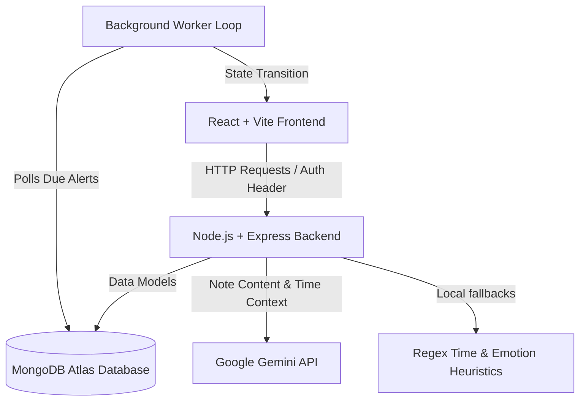

# Docket - Intelligent Empathetic Note-Taking & Scheduling Platform

Docket is a secure, multi-user web application designed for personal knowledge management, task categorization, and real-time cognitive reminders. It combines a clean, Notion-like rich-text noting canvas with an agentic AI background processing engine that analyzes user entries for task schedules, goals, and emotional states, delivering desktop-native push notifications and interactive dialogue channels.

---

## Key Capabilities

### 1. Secure Isolated Workspaces
- Supports multi-user session management via secure JSON Web Token (JWT) authorization.
- Isolates all database operations (notes, folders, categories, and notification channels) strictly to the authenticated user's boundary.

### 2. Cognitive AI Scheduling Engine
- Integrates Gemini API to analyze notes for deadlines, goals, work schedules, and emotional check-in opportunities.
- Detects the appropriate sender persona for each note:
  - **Docket's Doctor**: Calming support for notes expressing distress or anxiety.
  - **Docket's Companion**: Cozy, personal check-ins for general personal status or warm diary entries.
  - **Docket's Secretary**: Calendar alerts for checklists, schedules, meetings, and deadlines.
  - **Docket's Friend**: Celebrating personal achievements, sharing humor, or open chatting.
  - **Docket's Teacher**: Educational advice, test preparation assistance, and study goals.
- Enforces a conditional debounce analyzer:
  - Notes containing explicit time references (such as "in 2 mins", "at 9 PM", "tomorrow morning") run on a short **10-second** debounce delay.
  - General emotional/diary entries without specific time references run on a **5-minute** debounce delay.

### 3. Desktop Native Push Notifications
- Triggers standard HTML5 Native OS push notifications directly to the device tray (Windows, macOS, Linux, Android), even when the browser is minimized.
- Hosts an interactive sliding notification panel featuring custom avatars, action tabs, quick reply choices, and custom reply fields with typing state indicators.

---

## Technical Architecture

The application is structured as a decoupled monorepo:



---

## Technology Stack

### Frontend Client
- **Core Library**: React (Vite-powered single-page application)
- **Styling System**: TailwindCSS & DaisyUI for UI controls, styled in a premium monochromatic theme.
- **Icons**: Lucide React
- **Network Client**: Axios with client-time headers (`x-client-time`) injected on request bounds to normalize timezone differences.
- **Notifications**: Native Browser HTML5 Notification API + React Hot Toast for fallback overlays.

### Backend Services
- **Runtime Environment**: Node.js
- **Server Framework**: Express.js
- **Database Engine**: MongoDB with Mongoose Object Data Modeling (ODM).
- **Authentication**: bcryptjs for secure password hashing and jsonwebtoken for session verification.
- **AI Core**: Google Generative AI SDK (`@google/generative-ai`) leveraging `gemini-2.5-flash-lite` for cost-efficient response modeling.
- **Rate Limiting**: Custom Upstash Redis middleware to protect API endpoints against DDoS or brute-force attempts.

---

## Getting Started

### Prerequisites
- Node.js (version 18 or above recommended)
- A running MongoDB instance (or Atlas URI connection)
- A Google Gemini API Key

### Configuration
1. Configure backend environment settings in `backend/.env`. Refer to the backend developer's guide for variable definitions.
2. Configure frontend environment settings in `frontend/.env`.

### Running Locally
To launch both servers in development mode:

1. **Backend**:
   ```bash
   cd backend
   npm install
   npm run dev
   ```

2. **Frontend**:
   ```bash
   cd frontend
   npm install
   npm run dev
   ```
