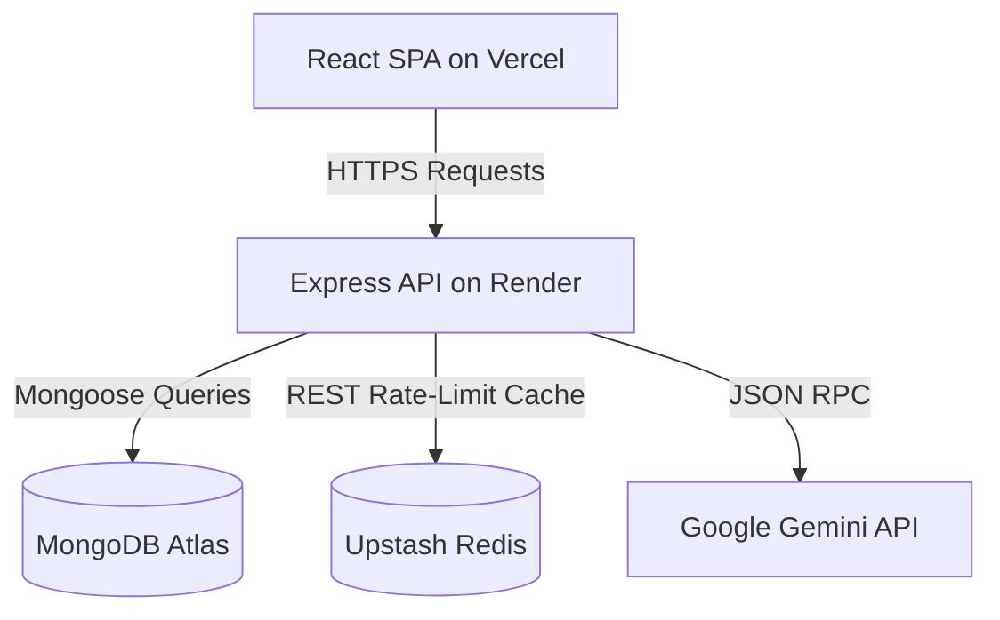

# Deployment Guide

This guide provides step-by-step instructions to deploy the Docket application in production, using **Render** for the backend API service and **Vercel** for the frontend React SPA client.

---

## Architecture Overview

In production, the application is deployed as a decoupled client-server architecture:
1. **Frontend (Vercel)**: React SPA served statically, configured with custom rewrite rules in `vercel.json` to handle client-side routing.
2. **Backend (Render)**: Express Node.js application running as a stateless Web Service. It connects to MongoDB Atlas and Upstash Redis.
3. **Database (MongoDB Atlas)**: Cloud-hosted MongoDB cluster.
4. **Rate Limiting (Upstash Redis)**: Cloud-hosted Redis instance for tracking IP-based sliding window request counters.



---

## Step 1: External Infrastructure Setup

Before deploying the codebase, ensure you have set up the following external cloud resources:

### 1. MongoDB Atlas (Database)
1. Sign up/log in to [MongoDB Atlas](https://www.mongodb.com/cloud/atlas).
2. Create a new Shared Cluster (M0 - Free Tier).
3. Under **Database Access**, create a user with read/write privileges.
4. Under **Network Access**, allow access from anywhere (`0.0.0.0/0`) since Render's IP addresses are dynamic.
5. Retrieve your connection string from the **Connect** wizard, choosing "Connect your application" (Node.js driver). Replace `<password>` and `<dbname>` in the string.
   - Example: `mongodb+srv://<username>:<password>@cluster.mongodb.net/docket?retryWrites=true&w=majority`

### 2. Upstash Redis (Rate Limiter Cache)
1. Sign up/log in to [Upstash Console](https://console.upstash.com).
2. Create a new Serverless Redis Database.
3. Once created, navigate to the database dashboard.
4. Under **REST API**, locate and copy the credentials:
   - `UPSTASH_REDIS_REST_URL`
   - `UPSTASH_REDIS_REST_TOKEN`

### 3. Google Gemini API (AI Persona Assistant)
1. Sign up/log in to [Google AI Studio](https://aistudio.google.com).
2. Generate an API key.
3. Save the key as your `GEMINI_API_KEY`.

---

## Step 2: Deploying the Backend on Render

1. Log in to [Render](https://render.com).
2. Click **New +** and select **Web Service**.
3. Connect your GitHub repository.
4. Configure the Web Service settings:
   - **Name**: `docket-backend` (or custom name)
   - **Environment**: `Node`
   - **Region**: Select the region closest to your users.
   - **Branch**: `main`
   - **Root Directory**: `backend` (Crucial: specifies that the backend codebase is in the subfolder)
   - **Build Command**: `npm install`
   - **Start Command**: `npm start`
   - **Instance Type**: Select **Free** (or your preferred tier).

5. Open the **Advanced** section to add the following **Environment Variables**:

| Variable Name | Description | Value |
| :--- | :--- | :--- |
| `NODE_ENV` | Environment | `production` |
| `MONGO_URI` | MongoDB Connection URL | `mongodb+srv://...` (your Atlas connection string) |
| `GEMINI_API_KEY` | Gemini API Key | `AIzaSy...` (your Google AI Studio key) |
| `UPSTASH_REDIS_REST_URL` | Upstash Redis URL | `https://...` (from Upstash Console) |
| `UPSTASH_REDIS_REST_TOKEN`| Upstash Redis Token | `...` (from Upstash Console) |
| `JWT_SECRET` | Secret for token signing | Random secure string (e.g. 32+ characters) |

6. Click **Create Web Service**. 
7. Once the build completes, copy your live backend URL (e.g. `https://docket-backend.onrender.com`).

---

## Step 3: Deploying the Frontend on Vercel

1. Log in to [Vercel](https://vercel.com).
2. Click **Add New** and select **Project**.
3. Import your GitHub repository.
4. Configure the Project settings:
   - **Framework Preset**: `Vite` (Vercel automatically detects this)
   - **Root Directory**: `frontend` (Crucial: specifies that the frontend codebase is in the subfolder)
   - **Build and Output Settings**: Leave as default (`npm run build` and `dist` output directory)

5. Expand the **Environment Variables** section and add:

| Variable Name | Description | Value |
| :--- | :--- | :--- |
| `VITE_API_URL` | Live Backend API URL | `https://docket-backend.onrender.com/api` (your Render backend URL with `/api` suffix) |
| `VITE_GOOGLE_CLIENT_ID`| Google OAuth Client ID | Your Google Client ID (e.g. `10086...apps.googleusercontent.com`) |

6. Click **Deploy**.
7. Vercel will install dependencies, build the React bundle, read the rewrite rules in [vercel.json](file:///c:/Users/SSN/OneDrive%20-%20Shiv%20Nadar%20University%20-%20Chennai/Documents/Projects/notes_app/frontend/vercel.json), and host the application.

---

## Troubleshooting & Verification

### 1. SPA Routing Returns 404 on Refresh
If refreshing a page like `/dashboard` returns a 404, verify that `vercel.json` is located in the root of the `frontend` folder (which maps to your Vercel project root) and contains:
```json
{
  "rewrites": [
    {
      "source": "/(.*)",
      "destination": "/index.html"
    }
  ]
}
```

### 2. CORS Errors in Browser Console
If the frontend cannot connect to the backend due to CORS errors:
- Ensure the backend configuration in `server.js` uses `app.use(cors())`.
- Verify that `VITE_API_URL` on Vercel is set to the correct Render service URL and includes the `/api` path suffix.

### 3. Latency in Background Notifications
Render's Free Tier spins down web services after 15 minutes of inactivity. When spun down, the first request may take 50+ seconds to spin up, delaying notifications. For production use cases, upgrading the backend service to Render's **Starter** tier keeps the server and notification worker thread running 24/7.
