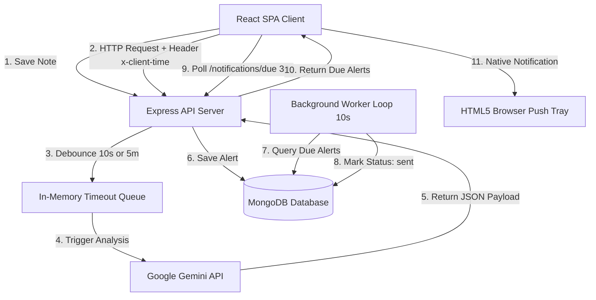

# Docket - Detailed System Design & Architecture Guide

This document provides a deep-dive analysis of Docket, detailing its product capabilities, technical architecture, engineering choices, and system design tradeoffs.

---

## 1. What is Docket?
Docket is an intelligent, multi-user personal knowledge workspace. It operates as a productivity app that allows users to write notes, create custom categories, and organize their daily schedules. Beyond standard notes, Docket features a background cognitive assistant that parses note entries to understand tasks, reminders, and emotional states. It automatically schedules personalized, empathetic notifications that can be received natively on a user's operating system.

---

## 2. What it Does
- **Secure Workspace Isolation**: Limits data access boundary per authenticated user session. All notes, folders, and notification records are partitioned using database-level ownership scopes.
- **Empathetic AI Personas**: Identifies the emotional tone or context of note entries and assigns one of five specialized Docket assistant channels:
  - **Docket's Doctor**: Calm support during times of distress or high anxiety.
  - **Docket's Companion**: Cozy and warm check-ins for diary entries or personal check-ins.
  - **Docket's Secretary**: Calendar alerts for checklists, tasks, and scheduling items.
  - **Docket's Friend**: Celebrating personal achievements, sharing jokes, or open chatting.
  - **Docket's Teacher**: Guiding study schedules, test preparation, and assignment deadlines.
- **Time-Sensitive Reminders**: Automatically parses explicit calendar times (e.g. "at 9 PM", "10:30 am", "tomorrow noon") and relative duration offsets (e.g. "in 2 mins", "after 5 mins") to schedule alerts.
- **Operating System Push Alerts**: Requests permission to access the browser's HTML5 Notification API. Triggers device push notifications directly on the desktop tray (Windows/macOS) even when the browser is minimized.
- **Interactive Conversational Flows**: Allows users to click "Reply" on notifications to open a sliding timeline drawer. Users can send custom text replies or click quick replies (e.g., "Done", "Good night") which triggers the backend AI to auto-schedule the next empathetic follow-up dialogue.

---

## 3. How it Does It

### Timezone Normalization Flow
Time zone inconsistencies are a common source of bugs in calendar apps. Docket normalizes timezones via a client-centric offset mechanism:
1. Every HTTP request made by the Axios client injects the browser's localized string representation of time in the `x-client-time` header:
   ```javascript
   config.headers["x-client-time"] = new Date().toString(); // e.g. "Wed Jun 03 2026 02:47:18 GMT+0530"
   ```
2. The backend extracts the offset (e.g. `GMT+0530` parses to `+05:30`).
3. When Gemini analyzes the note, the backend passes this localized time as the reference clock:
   `Current Local Time Reference: Wed Jun 03 2026 02:47:18 GMT+0530`
4. Gemini returns the scheduled time in the user's local timezone (e.g. `"scheduledAtLocal": "2026-06-03T02:49:18"`).
5. The backend parses this string, appends the user's offset, and instantiates a standard, timezone-aware JavaScript Date object:
   ```javascript
   const scheduledDate = new Date("2026-06-03T02:49:18+05:30");
   ```
6. This date is saved in MongoDB, which automatically stores it in UTC (`2026-06-02T21:19:18.000Z`). This guarantees that regardless of where the server is located, the notification fires at the user's correct local time.

### The Conditional Debounce Scheduler
To protect Gemini API limits and prevent server load spikes while typing, Docket implements a debouncing scheduler on note saves:
1. When a user creates or modifies a note, the backend clears any existing analysis timeouts for that note.
2. The backend scans the note content using a fast local regex-based time indicator parser:
   - If a time reference is found (e.g. "in 2 mins", "tomorrow morning"), the system sets a **10-second** debounce delay.
   - If the note contains emotional triggers but no explicit time, the system sets a **5-minute** debounce delay (allowing the user to finish writing a diary entry without blasting the API).
3. Once the debounce timer expires, the background worker invokes the Gemini analysis and saves the scheduled alert.

---

## 4. System Architecture

The monorepo contains a React frontend client and an Express backend server. Here is the block diagram of the system data flow:



---

## 5. Technology Stack Decisions & Rationales

### React + Vite (Frontend)
- **Choice**: Single-Page Application (SPA) powered by Vite.
- **Rationale**: Vite provides extremely fast Hot Module Replacement (HMR) and bundles assets into lightweight static builds, keeping frontend load times minimal. React's declarative rendering aligns with real-time UI state changes (such as sliding panels and typing loaders).

### Node.js + Express (Backend)
- **Choice**: Event-driven runtime with Node and a lightweight Express framework.
- **Rationale**: Node's non-blocking I/O model handles high-concurrency requests efficiently. It allows us to manage in-memory queues and intervals (like the database poller and debounce scheduler) within a single event loop without spawning heavy thread pools.

### MongoDB + Mongoose (Database)
- **Choice**: Document Store Database.
- **Rationale**: Notes are inherently semi-structured and unstructured documents. MongoDB's BSON document structure supports flexible schema definitions. Mongoose provides a schema abstraction layer that enforces validation and casts query inputs, protecting the server from NoSQL injection attacks.

### Google Gemini API (gemini-2.5-flash-lite)
- **Choice**: Cost-efficient LLM integration.
- **Rationale**: Emotion detection and relative time parsing require natural language understanding. Larger models like GPT-4 or Gemini 1.5 Pro are costly and slower. `gemini-2.5-flash-lite` provides sub-second latencies and structure-aware JSON outputs (`responseMimeType: "application/json"`) at a fraction of the cost, making it ideal for high-frequency notes.

### Upstash Redis
- **Choice**: Managed Redis store with rate-limiting APIs.
- **Rationale**: Protects endpoints from DDoS attacks. Upstash Redis allows rate-limiting policies to persist across instances, making the API server horizontally scalable in a containerized environment (e.g. Docker, Kubernetes, AWS ECS) without losing limit counts.

---

## 6. Engineering Choices & Tradeoffs

### Tradeoff 1: Long Polling vs. WebSockets / Server-Sent Events (SSE)
- **Implementation**: The client queries `/api/notifications/due` every 30 seconds (long polling).
- **Tradeoff**: WebSockets or SSE maintain a persistent connection, which allows instantaneous push alerts. However, they consume memory resources for open file descriptors and require complex scaling solutions (like Redis Pub/Sub backplanes) when scaling across multiple servers. Long polling is stateless and scales horizontally out-of-the-box. To mitigate the 30-second latency, Docket utilizes **Optimistic UI Refreshes**—when a note is saved or a user replies, the UI fires a localized window event to query updates instantly, combining the scale benefits of polling with the responsiveness of WebSockets.

### Tradeoff 2: In-Memory Debouncing vs. Distributed Message Queues (e.g., RabbitMQ, BullMQ)
- **Implementation**: Debouncing is tracked in the server's memory using a standard JavaScript `Map` of `setTimeout` references.
- **Tradeoff**: An in-memory queue is extremely simple to implement and requires zero extra infrastructure. The tradeoff is that if the backend server restarts, any active debounce timeouts are lost. In our case, this was deemed acceptable because note data is persistent, and the loss of a debounce timeout simply means the note isn't analyzed (and a user can easily trigger it again by editing the note). For enterprise scale, moving this to BullMQ with Redis backing would ensure persistent scheduling across server restarts.

### Tradeoff 3: Client-Side vs. Server-Side Time Normalization
- **Implementation**: The client injects the `x-client-time` string header, and the backend dynamically parses the offset for each note transaction.
- **Tradeoff**: Storing the user's timezone in their user profile schema is a common alternative. However, this forces the user to manually update their settings or requires the frontend to constantly sync profiles when users travel. Using the `x-client-time` request header keeps the user database record stateless, and automatically adjusts to travel or daylight savings changes instantly.
